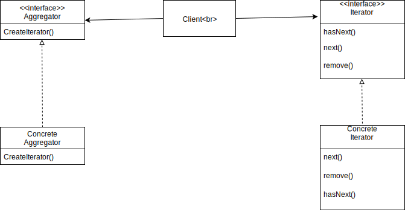

# Iterator, Composition

It relies on an interface called Iterator. With this interface you can implement iterators for any collection of objects.

Iterators encapsulate the inner workings of a collection of objects. Then, a loop that understands the iterator interface can handle any collection of objects polymorphically.

This patterns provides a away to access the elements of an aggregate object sequentially without exposing its underlying representation. It places the task of traversal on the iterator object not the aggregate.

Iterators imply no ordering The underlying collection can be an unordered hashtable. It may even contain duplicates.

## Internal vs. External Interators

Internal iterators control the iterator. This means they drive the iteration and knows what to do with each element. External iterators are controlled by a client that calls `next` on the iterator.

## Python Iterator

Iterators are an integral part of the core Python language. Python has an Iterator Protocol. It's very easy to turn any object into an iterable one. Iterable objects get a special treatment by the language. For example, you can easily loop over any object using `for` or check membership in it using the `in` operator. You'll also be able to use comprehensions \(`list`, `set`, `dict`\) with this object.

Design Principle

A class should have only one reason to change. Every responsibility of a class is an area of potential change. More than one responsibility means more than one area of change.

